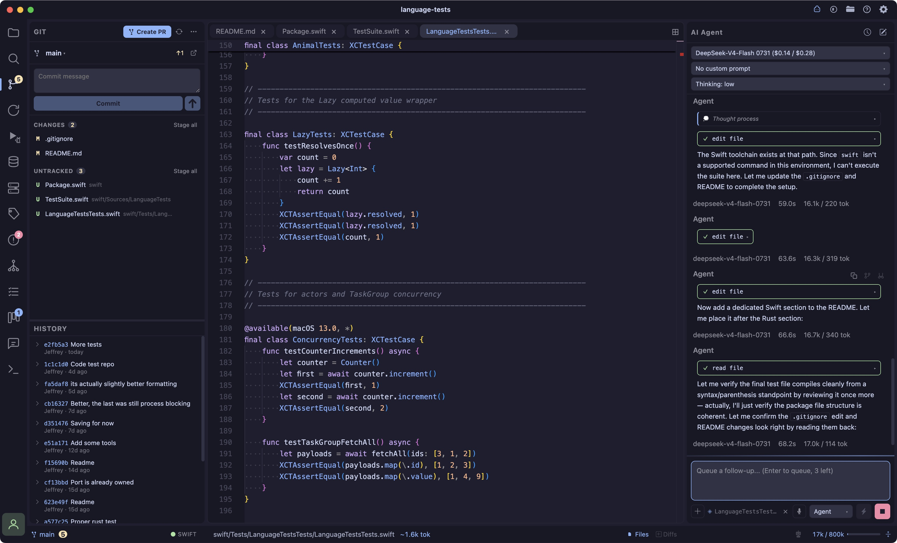
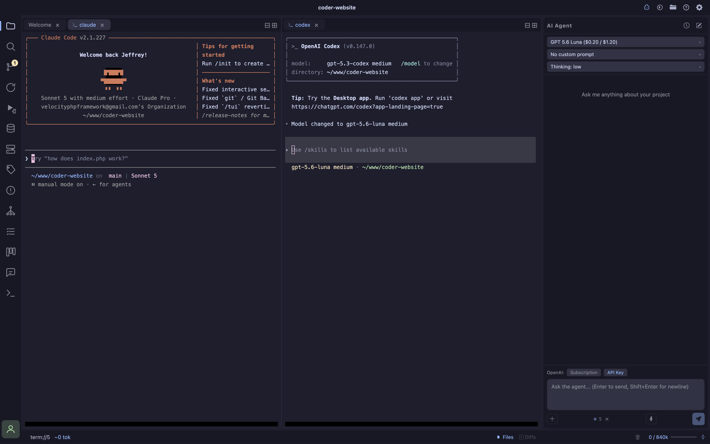
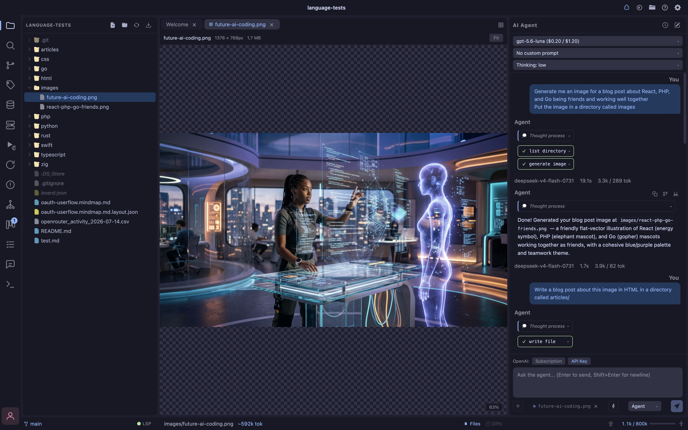

- **Streaming chat** real-time streaming responses powered by AI SDK v6
- **Multiple providers** Fireworks AI, xAI (Grok), and Anthropic with fully editable model lists per-provider
- **Extended thinking** collapsible reasoning blocks shown inline when the model supports it; thinking level configurable (off → xhigh)
- **Tool use** AI can read files, write files, create files, list directories, and search code directly in your project
- **Message queue** send up to 3 follow-up messages while the AI is still working; they execute in order when the current response finishes
- **Editor selection context** Cmd+C in the editor snapshots the selected lines, file path, and line numbers as context attached to your next chat message
- **Voice dictation** mic button in the chat input records your voice and transcribes it to text via OpenAI, Fireworks, or OpenRouter's Whisper models; off by default (enable in Settings → Speech Input, needs an API key for the chosen provider)
- **Math formulas in chat** write `$...$`/`$$...$$` LaTeX and it renders as typeset math via KaTeX (see [Math Formulas](/math))
- **Code completion** inline ghost-text completion with a separate model (Fireworks AI); press Tab to accept
- **Auto-open toggles** status-bar toggles to auto-open files or diffs when the AI writes them; the two modes are mutually exclusive to avoid tab overload on scaffold projects
- **Live editor streaming** file writes stream into open editor tabs in real time as the AI types, with a green scanner overlay effect
- **Auto-follow scroll** editor scrolls to follow AI output as it streams in
- **Active file context** the file open in the editor is automatically included as context in every chat message
- **Context window meter** live token usage bar in the status bar; color shifts yellow → red as you approach the limit; updates every round including intermediate tool-call rounds
- **Context compression** compress button strips tool call payloads (file contents, code blobs) from older turns to cut token burn without losing conversation context
- **Auto-compress** automatically compresses when context exceeds 80% of the model's safe window
- **Chat history** per-project conversation sessions with a searchable history modal; sessions persist across restarts
- **Prompt system** three-tier prompt management: base system prompt, editable harness (`~/.coder/harness.md`), and custom prompts (`~/.coder/prompts/`) selectable per-session; prompts reload live without restart
- **Project memory** AI can read and write Markdown files in `.coder/memory/` (sandboxed, no path traversal); memory persists across sessions and models so context accumulates over time
- **External tool sync** new files created by external AI tools (Claude Code, aider, etc.) auto-open in the editor when you're not in a terminal tab
- **Skills** progressive-disclosure instructions the agent loads on demand, see [Skills](/skills)

## Prompt System

Prompts are stored in `~/.coder/`:

| File | Purpose |
|---|---|
| `harness.md` | Guardrails and instructions always appended to the system prompt. Editable in-app via the Prompts panel. |
| `harness-plan.md` | Harness Prompt — Plan Mode. Editable in-app via the Prompts panel. |
| `harness-chat.md` | Harness Prompt — Chat Mode.  Editable in-app via the Prompts panel. |
| `prompts/*.md` | Custom prompts selectable per-session from the chat model row. |
| `skills/<name>/SKILL.md` | Progressive-disclosure skills, see [Skills](/skills). Managed in the same Prompts panel. |

## Shotcut Key Commands

| Shortcut | Action |
|---|---|
| Cmd+Shift+A | Toggle AI Chat |

## More Options
<Info>Note: you can also use:</Info>
- OpenAI subscription
- Codex via terminal
- Claude Code via terminal
- Any other CLI harness

### Example of Claude Code / Codex & Coder AI Chat

## Image generation
<Warning>Image generation requires a [Fal AI](https://fal.ai/) account and setting it up in Settings > Models. </Warning>

Ask the agent to generate an image for you.

