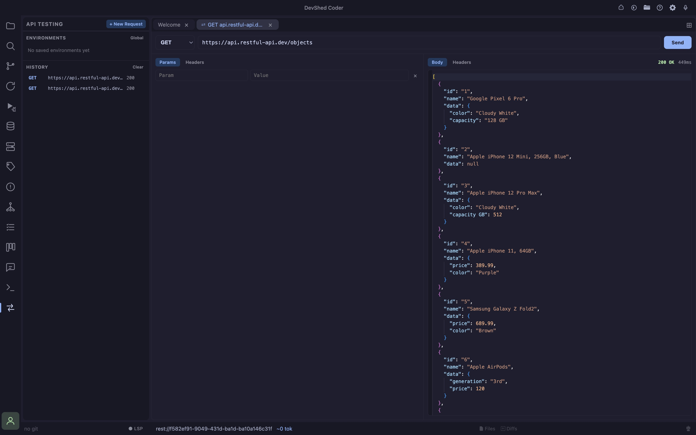

- **Test requests without leaving the editor** open a `rest://` tab, pick a method and URL, and send, response, headers, and timing show up next to the request, same as a dedicated API client but inside Coder
- **Runs through a local Go sidecar, not the browser** requests execute in a small native process, not the renderer's fetch, no CORS restrictions and no browser-restricted headers, since a real HTTP client is making the call, not a webpage
- **Params, Headers, and Body tabs** three sub-tabs under the URL bar hold query params, headers, and the request body; Params sync both ways with the URL, edit a row and the URL's query string updates, paste a URL with `?a=1&b=2` and Params fills in from it
- **Syntax-highlighted body and response** both the request body editor and the response viewer are Monaco, so JSON gets real syntax highlighting; the response language is picked automatically from the reply's `Content-Type` (JSON, HTML, or XML)
- **Saved environments** save a base URL plus auth (Bearer token, Basic auth, or an API key header) as a named environment, globally or per-project; opening a request against one prefixes relative paths with its base URL and adds its auth automatically, tokens are encrypted on disk and never sent back to the editor once saved
- **Request history** every send is logged with method, URL, status, and timing in the sidebar; click a history entry to reopen it as a new pre-filled request tab, or delete individual entries (or clear everything) with the buttons on each row / the section header
- **New tabs are scratch space** `rest://` tabs don't persist across a reload, they're throwaway request scratchpads, not saved work, so nothing dead is left behind after Cmd+R; save an environment or rely on history for anything you want to keep
- **Cmd+Shift+Y** toggles the API Testing panel

## Environments

An environment bundles a base URL with the auth Coder should attach automatically:

- **None**, no auth header added
- **Bearer Token**, adds `Authorization: Bearer <token>`
- **Basic Auth**, adds `Authorization: Basic <base64(user:pass)>`
- **API Key**, adds a custom header name/value pair (e.g. `X-API-Key`)

Environments can be **global** (available in every project) or **project-scoped** (only visible in the project they were created in), the sidebar lists both together. Secrets (tokens, passwords, key values) are encrypted at rest and are never round-tripped back to the editor after saving; re-saving an environment without touching its secret field keeps the existing value.

## History

Every request that's actually sent is recorded, method, URL, request headers/body, response status, and timing, so you can come back to it later without re-typing anything. History is global (not tied to one project) so a request made anywhere shows up in the list.

<Info>This tool will grow to more advanced features</Info>