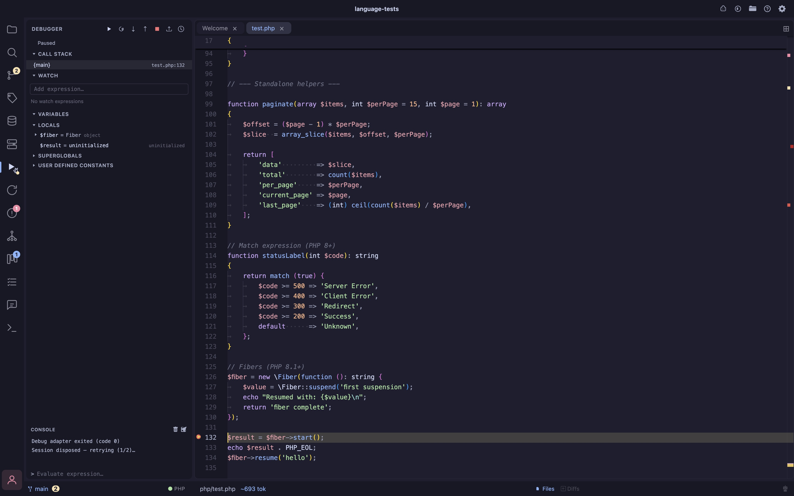
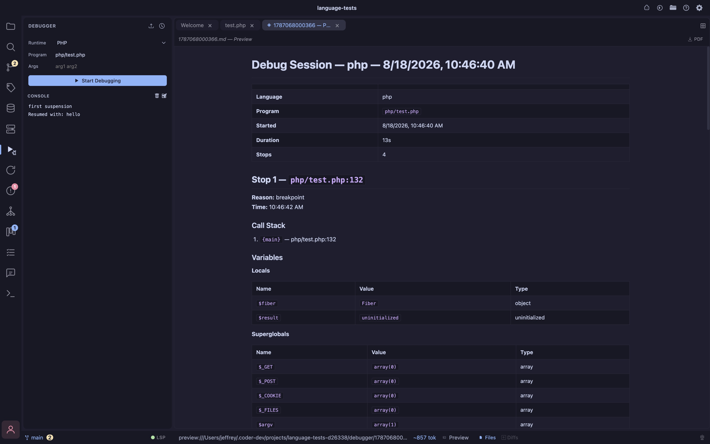

- **Multi-language** debug Node.js, Go, Rust (requires `lldb-dap`), Python, and PHP (via xdebug) using the Debug Adapter Protocol (DAP); language auto-detected from the project, or manually selected in the launch form
- **Step controls** Continue, Step Over, Step In, Step Out, and Stop; controls are disabled while the program is running and re-enable on each pause
- **Call stack** full stack trace on every pause; click any frame to load its local scope
- **Variables** all in-scope variables grouped by scope (Locals, Superglobals, etc.) with syntax-colored values and expandable objects/arrays
- **Watch expressions** add any expression to the Watch panel; evaluated at every pause using DAP `context: watch`; results update live and changed values are highlighted
- **Debug console** program output (stdout/stderr), adapter messages, and REPL in one scrollable panel; each category is color-coded; the REPL evaluates arbitrary expressions in the current frame
- **Session recording** every debug session is automatically recorded to `~/.coder/projects/{id}/debugger/{timestamp}.jsonl` in NDJSON format (one JSON record per line); sessions with zero stops are discarded automatically so timing noise from xdebug reconnects never pollutes history
- **Export to Markdown / HTML** export the full session — every stop, every variable, the complete call stack, and all console output — to a formatted `.md` or `.html` file; the exported file opens automatically as a new editor tab
- **Copy as AI-readable text** one-click copy of the entire session as a clean, compact text summary ready to paste into any AI chat; noise is stripped (empty values, `$_SERVER`, `$argv`, `$argc`, constants scopes) and variables that changed between stops are flagged with `*`
- **Session history** clock icon in the debugger header opens a modal listing every recorded session for the current project with language, entry-point filename, and timestamp; each entry has copy-as-text and export (MD/HTML) actions
- **Retry on dispose** xdebug can close its socket before a new attach completes; the debugger retries automatically up to 3 times with escalating backoff (800 ms / 1600 ms) so a stale socket never blocks a fresh run
- **Toggle** `Cmd+Shift+D` opens and closes the Debugger panel

## Requirements

The debugger connects to debug adapters you have installed — none of them ship with Coder. 
See [Language Intelligence → DAP debuggers](/lsp#dap-debuggers) for the full per-language install table, including:
- Rust/Zig's `lldb-dap` setup (ships with the Xcode Command Line Tools via `xcode-select --install`, or `brew install llvm`) 
- the caveat that both require a binary (`cargo build` / `zig build`) 
- the debugger doesn't invoke either build tool for you.

## Debugger Reports

