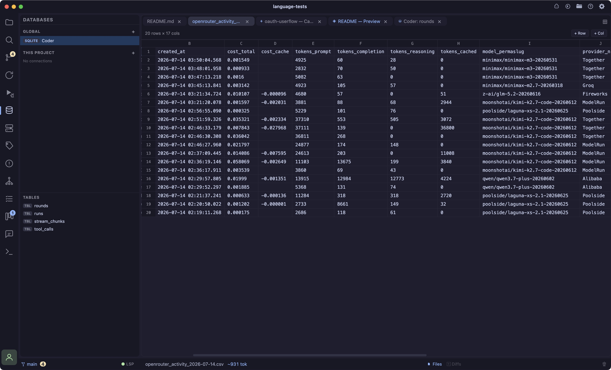
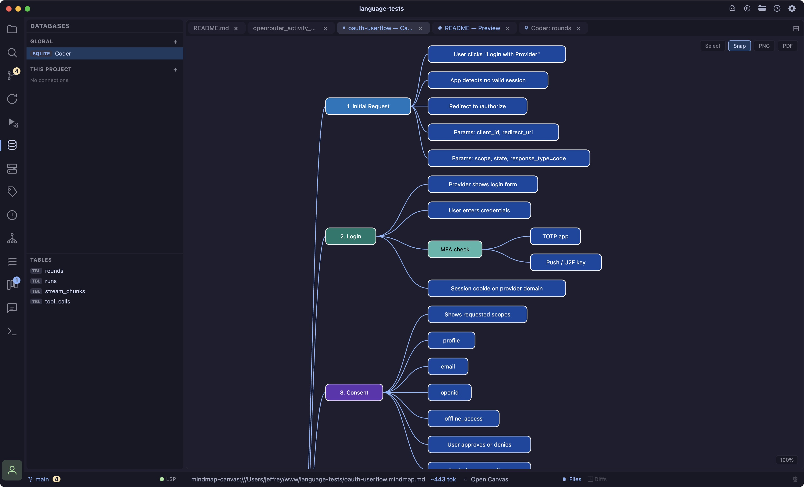
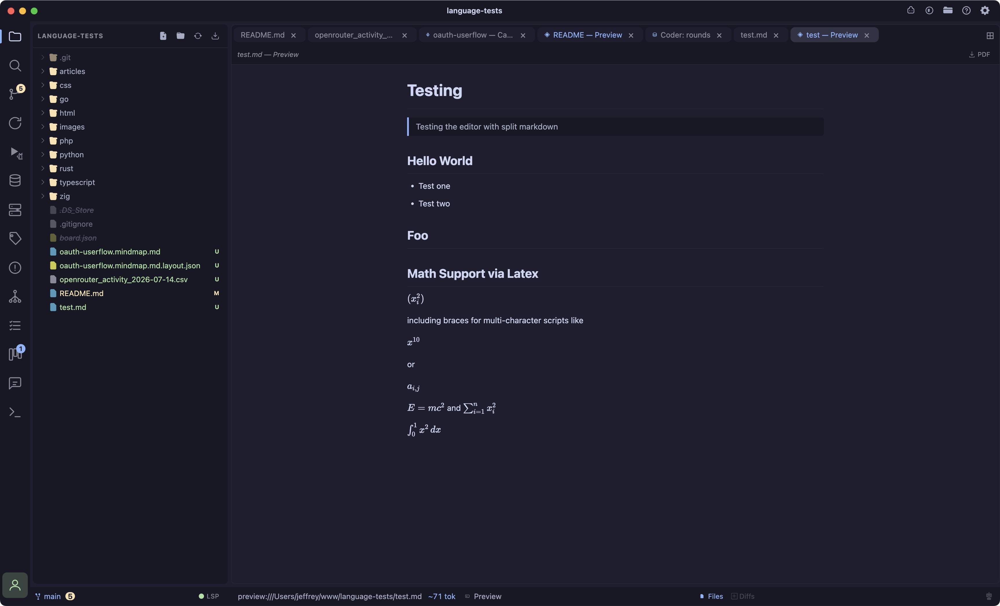

The editor itself, tabs, split views, syntax/semantic highlighting, and language-specific tooling built on top of [Monaco](https://microsoft.github.io/monaco-editor/), the same engine that powers VS Code.

## Tabs

- **Opening** clicking a file in the tree opens it as a full tab immediately, there's no italic "preview" tab that gets replaced by the next click, like VS Code's single-click preview mode. If a file's already open, clicking it again just focuses the existing tab.
- **Unsaved indicator** a `●` dot replaces the close button on any dirty tab.
- **Pinning** right-click a tab → Pin Tab. Pinned tabs move to the front of the strip and survive "Close All Tabs."
- **Reordering** drag a tab within its group to reorder it.
- **Moving across groups** drag a tab onto another group's tab strip, or use the tab context menu's "Move to Other Group" (or "Split to New Group" if there's only one group).
- **Context menu** right-click any tab for Pin/Unpin, Move to Other Group, Copy Path, Close Tab.
- **Close All Tabs** (`Cmd+Shift+W`) closes everything except pinned tabs and terminals; reopens the Welcome tab if nothing's left.
- **Many tab kinds share the strip**, regular files, Markdown preview, diffs, terminals, the debug console, browser preview, CSV/TSV grids, mindmap source/canvas, images, DB tables, and remote/SFTP files each get their own icon and, where relevant, distinct styling.
- **Remote files ask before closing dirty**, closing a dirty SFTP tab prompts for confirmation, since a lost edit against a live server is riskier than a lost local edit. Local files close silently.

## Split editor groups (grid layout)

Coder's editor area is a true grid, up to **5 panes total**, split along any of three axes:

- **Columns** side by side, left to right. `Cmd+\` (the `⊞` button) adds a new full-height column to the right of the active one.
- **Stacked rows** within a column, top to bottom, e.g. a tall Claude Code terminal above two shorter command terminals. `Cmd+Shift+\` (the stacked-rectangle button) splits the active pane into a new row below it, confined to that column, up to 3 rows deep.
- **Sub-panes** side by side within a single row, confined to that row's height. The row-split button (the short side-by-side rectangle icon) splits the active pane into a new sub-pane beside it, up to 3 per row, without touching the rest of the column's stack.

A pane can be a column, a row within a stacked column, or a sub-pane within a row, nesting stops there; a sub-pane can't itself be split further.

- **Shared buffers** the same file opened in two panes shares one underlying model, edit it in one pane and the other updates live, rather than holding two independent copies.
- **Resizing** drag any divider, between columns, between stacked rows, or between sub-panes in a row. Widths/heights are clamped to a sane minimum and persisted per-pane.
- **Closing a pane** (`×` on the tab strip) is blocked on the last remaining pane; any terminal that only lived in that pane has its process killed rather than orphaned. Closing one pane of a stack or row moves focus to a sibling in the same row, then the same column, before falling back further away.
- **Focus** click anywhere in a pane to make it active; inactive panes mute their tab strip so it's obvious which one has focus. `Cmd+Shift+Arrow` moves focus between panes in the direction pressed, left/right first steps through sub-panes within the current row before crossing into the next column, up/down steps through a column's stacked rows, and landing in a pane immediately focuses its content (the Monaco cursor for a file, or the terminal's input for a shell), so you can keep typing without an extra click.
- Terminals, diffs, Markdown preview, the debug console, browser preview, and the mindmap canvas can each only live in one pane at a time (they hold a single PTY or webview); splitting *moves* these instead of cloning them, leaving the new pane with the welcome screen.
- **Persisted** the full grid shape, columns, stacked rows, and sub-panes, survives a reload or restart, including which pane a still-alive terminal was in across a same-session reload. Terminal *processes* don't survive a full quit, since they're not saved to disk, but the pane they lived in comes back empty and ready for a new one.

## File tree

- **Create/rename/delete** via the tree header (New File, New Folder) or right-click context menu (also: Copy, Copy Path, Paste, Delete).
- **Drag and drop** drag any file or folder onto a directory to move it there, or onto empty space below the tree to move it to the project root.
- **Compare any two files** right-click → "Select for Compare," then right-click a second file → "Compare with…", opens an arbitrary two-file diff tab, independent of git.
- **Git decorations** modified/staged/untracked/deleted badges and colored filenames; directories containing changes show a dot even while collapsed.
- **Lazy loading** large directories (`node_modules`, `.git`) load their children on first expand rather than up front.

## Language support

Built-in Monarch grammars cover TypeScript/JavaScript, HTML, CSS/SCSS/Less, JSON, Markdown, YAML, Python, Rust, Go, Ruby, PHP, C/C++, C#, Java, SQL, and XML. A few languages Monaco doesn't ship at all are hand-written: **Zig**, **TOML**, JSONL, and Coder's own `.mindmap.md` format.

**PHP gets extra treatment**: Monaco's stock PHP grammar tags every bare word, properties, methods, calls, as one generic token, so function calls and variables end up the same color. Coder patches the grammar to tag `name(` calls separately, and every built-in editor theme carries a matching set of `*.php` color rules.

### Semantic highlighting (TypeScript / JavaScript)

Monarch grammars can't tell a function call apart from a variable or a parameter, they're all just "identifier." For `.ts`/`.tsx`/`.js`/`.jsx`, Coder runs a custom TypeScript language-service worker (the same source VS Code uses for semantic tokens) so classes, parameters, properties, and locals each get their own color, layered on top of the base syntax highlighting. If the worker fails for any reason, plain syntax highlighting still applies underneath, nothing breaks or goes blank.

### PHP docblocks

Typing `/**` above a function and pressing Enter auto-continues the block with `* ` on each line and closes it with `*/`, same as VS Code's JSDoc behavior. Typing `/**` also offers a snippet with `@param`/`@return` tab stops, it deliberately ranks below intelephense's own signature-aware docblock completion when both are available, so you get real parameter names and types when the LSP can supply them.

## Editing

- **Bracket pair colorization** and **inline AI completions** (ghost-text, ["AI"](/ai)) are on.
- **Format on save** optional, off by default, see Settings below. If it fails, the save still goes through.
- **Format Document** (`Cmd+L`) reformats the current file; for HTML/PHP, embedded `<style>`/`<script>` blocks are extracted and formatted with their own language's formatter, then spliced back in, since the outer language's formatter alone would leave them untouched.
- **Go to definition** (`Cmd/Ctrl+click` or F12) always jumps directly to a real editor tab, never Monaco's inline "peek" popup, even across files.
- **View state** scroll position and cursor location are remembered per file and restored when you come back to a tab.
- **External changes** if a file changes on disk while it's open (another process, a git operation), the change is merged into the live buffer in place, undo history and cursor position survive, instead of a full reload.
- **Copy to AI** copying a selection also snapshots the file path, line range, and language for the AI chat panel to reference.
- No minimap, no word wrap, and no breadcrumbs/sticky-scroll, none of these are currently implemented or user-configurable.

## Settings

**Settings → General**: editor color theme (see [Themes](/themes)), editor font size (8–32px).

**Settings → Editor**: indent size (2/4 spaces), indent style (spaces/tabs), format on save.

## Shortcut Key Commands

| Shortcut | Action |
|---|---|
| Cmd+S / Cmd+Alt+S | Save / Save all |
| Cmd+W / Cmd+Shift+W | Close tab / Close all tabs |
| Cmd+L | Format document |
| Cmd+D | Duplicate line |
| Cmd+F | Find in file |
| Cmd+\ | Split editor right (new column) |
| Cmd+Shift+\ | Split pane down (new stacked row) |
| Cmd+Shift+] / [ | Next / previous tab (within the active pane) |
| Cmd+Shift+Arrow | Focus the adjacent pane (left/right/up/down through the grid) |
| Cmd+Shift+I | Open diff for active file |
| Cmd+Shift+V | Preview Markdown / Open HTML in browser |
| Cmd+Shift+X | Open Mindmap canvas tab |

All remappable in Settings → Keybindings. See [Shortcuts & Workflows](/shortcuts) for the full list.

## Our editor does more!

__CSV & TSV Prarsing and Editing__

__Mindmaps__

__Math Formulas__
