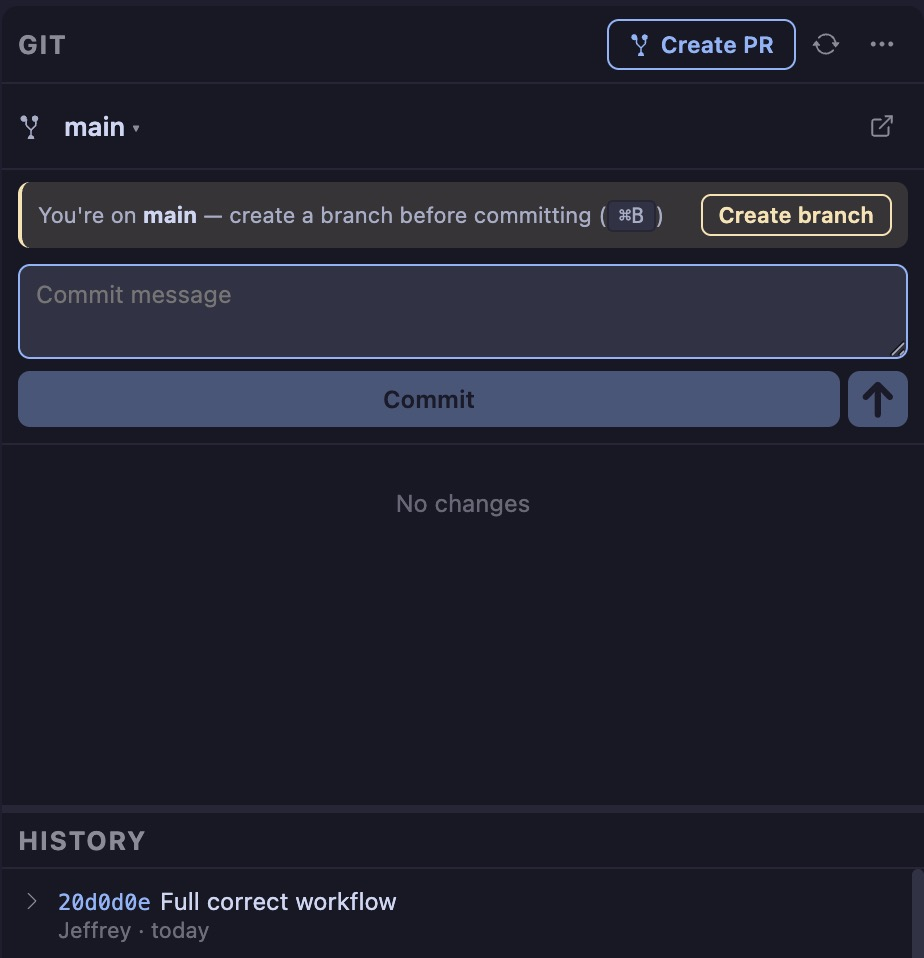
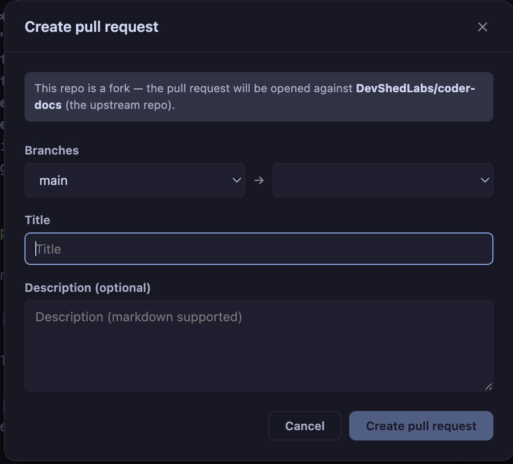

## Workflows
- `Cmd+B` Create branch (name + "from" branch dropdown, defaults to current), creates + checks out in one step
- `Cmd+K` Stage all & commit (existing)
- `Cmd+U` Push (existing, now also auto-sets upstream for a brand-new branch)
- `Cmd+;` Create PR (existing)

__Hopefully__ the create branch notices saves some pain points.

## Details 

- **Status panel** staged, unstaged, and untracked files grouped and live-updated via FS watcher
- **Stage / unstage** per-file or all at once
- **Commit** message box with Cmd/Ctrl+Enter to commit; errors surfaced inline
- **Push / Pull / Fetch** remote sync with in-flight indicator and inline error banner
- **Discard changes** per-file or discard-all with two-click confirm
- **Branch switcher** click the branch name to open a dropdown of local and remote branches; pick one to check out, with local branches checkmarked and grouped ahead of remote ones
- **Create branch** "+ New branch…" in the switcher creates and checks out in one step
- **Delete branch** trash icon per local branch (hidden on the current branch, no deleting the branch you're on) with a two-click confirm
- **Open on web** button next to the branch name opens the repo's page (GitHub, GitLab, or any host) in your default browser, resolved from your actual git remote, no more finding it manually
- **Branch + ahead/behind** always visible in the panel header and status bar
- **Dirty count badge** uncommitted file count shown right on the Git activity-bar icon, so you don't need the panel open to see there's something to commit
- Uses your system git, inherits your existing config, SSH keys, and credential helpers
- Create new PR's right from the interface

__Auto Upstream detection__

## Shotcut Key Commands

| Shortcut | Action |
|---|---|
| Cmd+Shift+G | Toggle Git |
| Cmd+K | Git: stage all & commit |
| Cmd+U | Git: push |
| Cmd+Shift+C | Clone repository |