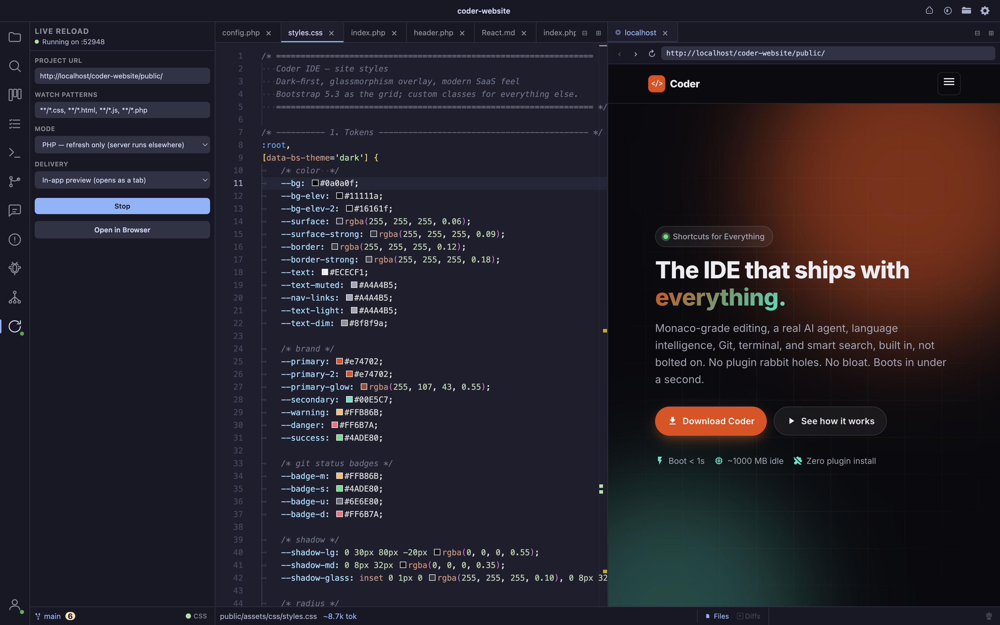

- **Watch and refresh** point Live Reload at a project URL and a set of watch patterns (defaults to `**/*.css`, `**/*.html`, `**/*.js`, `**/*.php`); saved files trigger a refresh automatically, reusing the same batched file watcher as the file tree (no second watcher, no duplicate work)
- **Three modes** **Frontend** (refresh only), **PHP refresh** (refresh only, your own server, e.g. Laravel Herd/Valet, keeps running outside Coder), or **PHP restart** (Coder spawns and restarts your dev server itself, e.g. `php -S localhost:8000`, before refreshing)
- **CSS live-swap** a CSS-only change re-fetches just the changed stylesheet (cache-busted) with no full page reload; any other change does a full hard reload that also bypasses the browser's HTTP cache, so stale CSS/JS never lingers after a save
- **External or in-app delivery** **External** injects a tiny snippet + local WebSocket into your own browser tab (copy-paste one `<script>` tag, shown in the panel once running); **In-app** opens the page directly inside Coder as a real editor tab, no snippet needed, reload is driven natively
- **Persistent port** the external mode's local server reuses the same port across restarts when possible, so a pasted `<script>` tag keeps working without edits
- **Toggle** activity bar icon opens the Live Reload panel; configure and Start/Stop per project

## Shotcut Key Commands

| Shortcut | Action |
|---|---|
| Cmd+Shift+L | Toggle Live Reload |