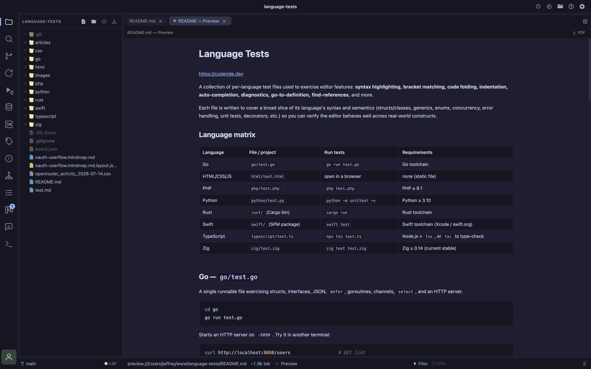

- **Go sidecar** a lightweight Go binary manages language servers in a separate process, keeping the editor responsive (the broker idles at ~7MB)
- **Go-to-definition** Cmd/Ctrl+click or F12 jumps to a symbol's definition; cross-file targets open as a new editor tab at the right line
- **CSS class linking** in HTML and PHP templates, `class="…"`/`id="…"` autocomplete and jump-to-definition resolve against linked stylesheets and inline `<style>` blocks
- **Problems panel** a dedicated sidebar lists all diagnostics grouped by file with an error-count badge on the activity bar; click any problem to jump to it; copy individual errors or all errors at once to paste directly into the AI chat
- **Indexing indicator** the status-bar LSP chip shows "Indexing…" while a language server builds its workspace index, "Starting…" while a language's own client handshake is still in flight (some servers — Ruby's ruby-lsp especially — can take much longer than the sidecar itself to come up on a cold cache), then turns green when ready
- **Toggle** click the LSP chip in the status bar to turn language servers on/off; the sidecar process only runs when enabled

Language features (hover, go-to-definition, autocomplete, diagnostics) are provided by standard LSP servers, brokered by a small Go binary (`lsp-sidecar/`) that runs as a separate process from the editor. The sidecar manages each language server's lifecycle, bridges LSP JSON-RPC over a local WebSocket to Monaco, and keeps the heavy language-tooling work off the editor's process budget.

**None of these servers or adapters ship with Coder** (TypeScript is the one exception — see its own page). Each is a small, independent, well-known tool you install once on your machine; Coder finds it automatically on your `PATH` (or a handful of common non-`PATH` install locations, like `~/.cargo/bin` or `~/go/bin`) the next time you open a matching file.

If a language server or debug adapter isn't found, that language still gets full syntax highlighting — it just runs without diagnostics/completions (or without a debugger) until the tool is installed.

## Languages

Install instructions, debugger setup, and per-language gotchas live on their own pages:

- [PHP](/languages/php)
- [TypeScript / JavaScript](/languages/typescript)
- [HTML / CSS / SCSS / Less](/languages/html-css)
- [Go](/languages/go)
- [Rust](/languages/rust)
- [Zig](/languages/zig)
- [Python](/languages/python)
- [Swift](/languages/swift)
- [C / C++](/languages/cpp)
- [Ruby](/languages/ruby)

## Where Coder looks

Beyond a plain `PATH` lookup, Coder also checks a handful of common non-`PATH` install locations (documented per-language on each language's own page — e.g. `~/.cargo/bin` for Rust, `~/go/bin` for Go), since a packaged GUI app on macOS is often launched with a minimal `PATH` that doesn't match your shell's.

Coder also tries to resolve your real login-shell `PATH` directly (via `$SHELL -lic`) before falling back to those extra locations, so most shell-managed installs (nvm, volta, rbenv, asdf, etc.) are found without needing any of this.

## DAP, debuggers

See [Debugger](/debugger) for the debugger UI itself, and each language's own page for its adapter's install steps and gotchas. In general:

- Every adapter is one Coder finds on your machine, same "nothing bundled" policy as LSP servers.
- Most compiled languages (Rust, Zig, Swift, C/C++) share the same [lldb-dap](https://lldb.llvm.org/) adapter and expect a binary you've already built — Coder doesn't invoke `cargo build`/`zig build`/`swift build`/your C compiler for you, except Go's Delve, which compiles as part of `launch`.
- `brew install llvm`'s `lldb-dap` isn't linked onto `PATH` by default on macOS — you may need to add `$(brew --prefix llvm)/bin` to your `PATH`, or symlink it into `/opt/homebrew/bin`.

## Performance

The variable cost is the **language servers**, which run as their own processes. intelephense (PHP) in particular holds the full workspace symbol index in memory and can range from ~300MB to ~1GB depending on project size — see [PHP](/languages/php#performance) for how to bound it. Any server can be shut down entirely by disabling the LSP via the status-bar chip when you don't need language features.

## LSP Examples

### PHP

### Go

### Rust

### TypeScript

### Zig

### Swift

### Mixed with Problems

