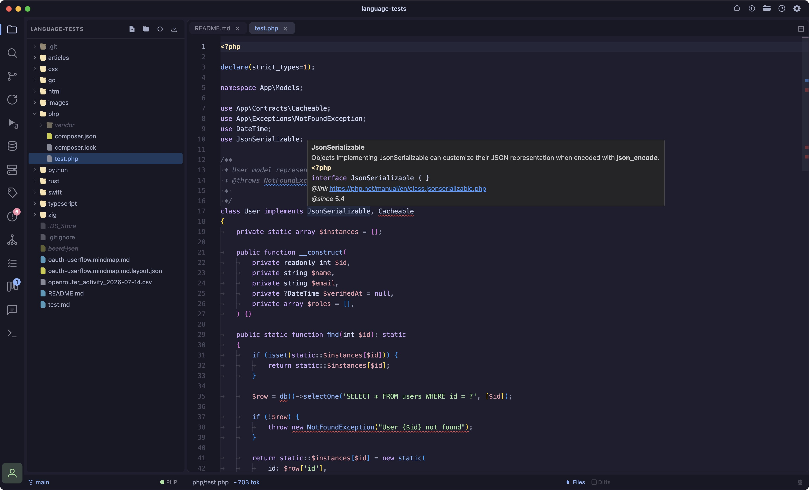
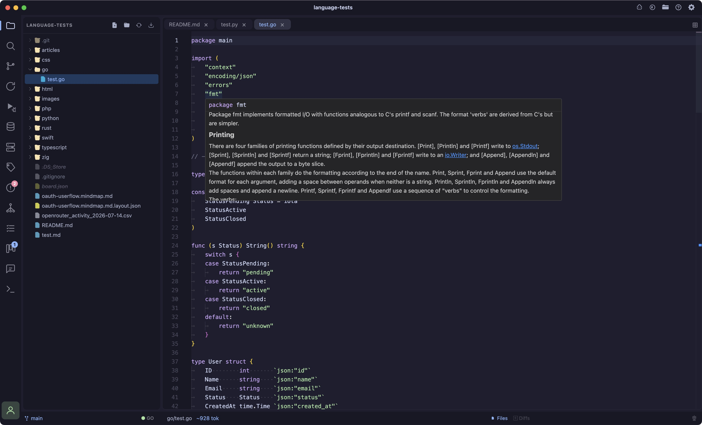
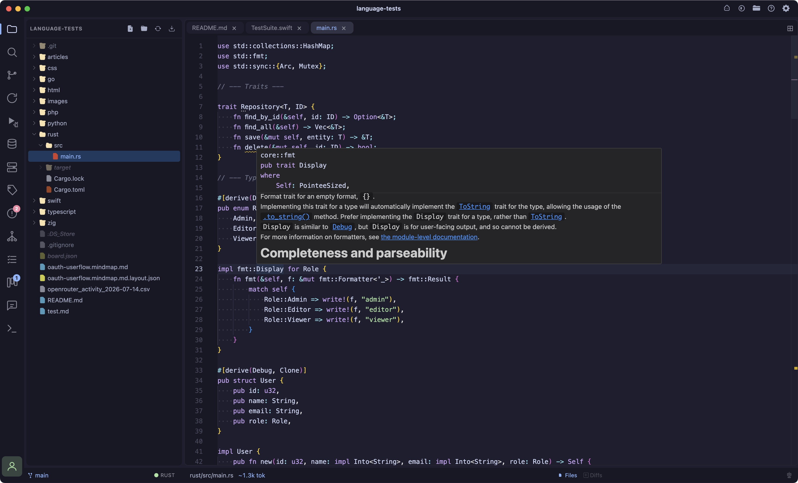
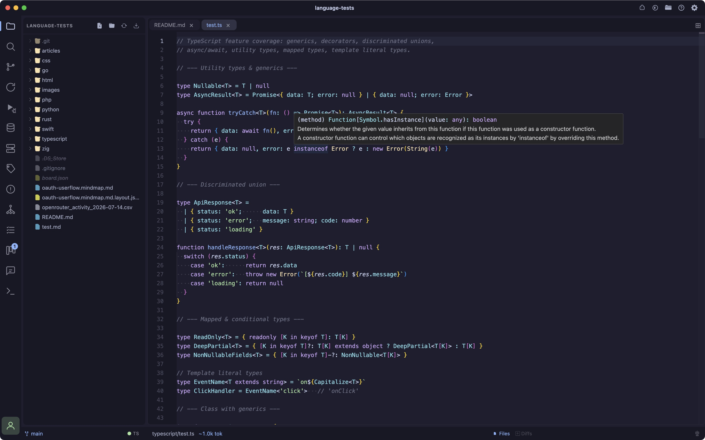
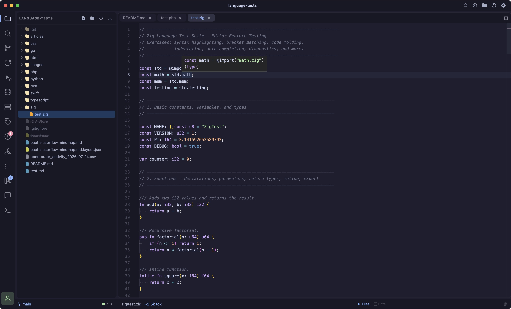
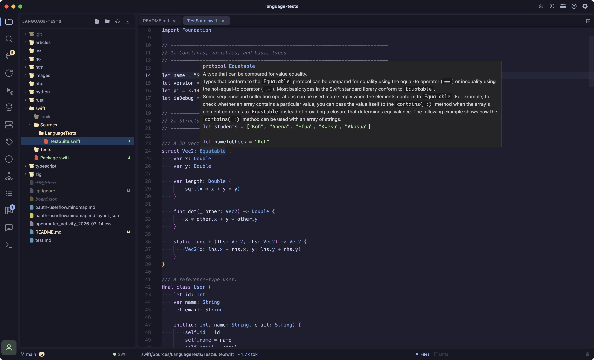
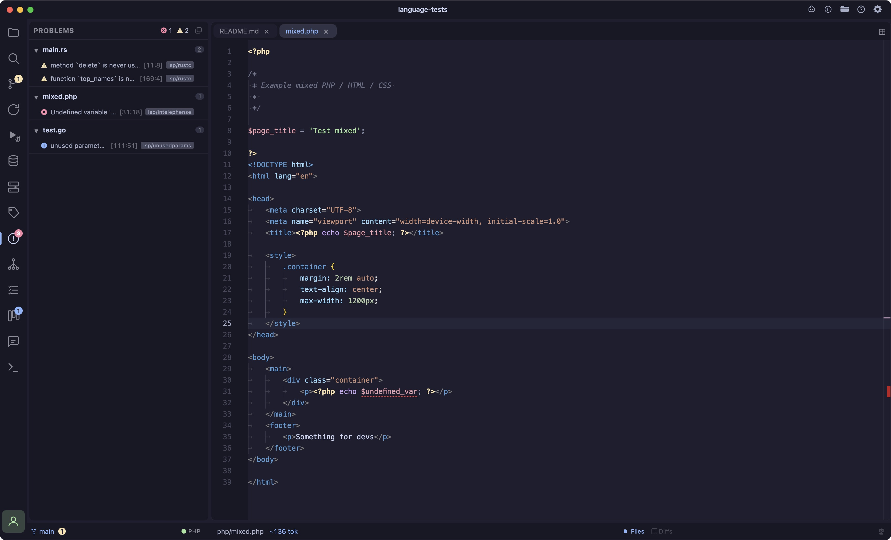

- **Go sidecar** a lightweight Go binary manages language servers in a separate process, keeping the editor responsive (the broker idles at ~7MB)
- **PHP** powered by [intelephense](https://intelephense.com/) (falls back to [phpactor](https://phpactor.github.io/) if installed): hover docs, go-to-definition across files, autocomplete, and diagnostics
- **HTML & CSS/SCSS/Less** powered by the VS Code language servers (`vscode-langservers-extracted`): completions, hover, and diagnostics
- **Go-to-definition** Cmd/Ctrl+click or F12 jumps to a symbol's definition; cross-file targets open as a new editor tab at the right line
- **CSS class linking** in HTML and PHP templates, `class="…"`/`id="…"` autocomplete and jump-to-definition resolve against linked stylesheets and inline `<style>` blocks
- **Problems panel** a dedicated sidebar lists all diagnostics grouped by file with an error-count badge on the activity bar; click any problem to jump to it; copy individual errors or all errors at once to paste directly into the AI chat
- **Indexing indicator** the status-bar LSP chip shows "Indexing…" while a language server builds its workspace index, then turns green when ready
- **Toggle** click the LSP chip in the status bar to turn language servers on/off; the sidecar process only runs when enabled

Language features (hover, go-to-definition, autocomplete, diagnostics) are provided by standard LSP servers, brokered by a small Go binary (`lsp-sidecar/`) that runs as a separate process from the editor. The sidecar manages each language server's lifecycle, bridges LSP JSON-RPC over a local WebSocket to Monaco, and keeps the heavy language-tooling work off the editor's process budget.

**None of these servers or adapters ship with Coder** (TypeScript is the one exception — see below). Each is a small, independent, well-known tool you install once on your machine; Coder finds it automatically on your `PATH` (or a handful of common non-`PATH` install locations, like `~/.cargo/bin` or `~/go/bin`) the next time you open a matching file.

If a language server or debug adapter isn't found, that language still gets full syntax highlighting — it just runs without diagnostics/completions (or without a debugger) until the tool is installed.

## LSP — language servers

| Language | Server | Install |
|---|---|---|
| PHP | [intelephense](https://intelephense.com/) (preferred) | `npm install -g intelephense` |
| PHP | [phpactor](https://phpactor.readthedocs.io/) (fallback — used only if intelephense isn't found) | `composer global require phpactor/phpactor` |
| TypeScript / JavaScript | [typescript-language-server](https://github.com/typescript-language-server/typescript-language-server) | `npm install -g typescript-language-server typescript` |
| HTML | [vscode-html-language-server](https://github.com/microsoft/vscode-html-languageservice) | `npm install -g vscode-langservers-extracted` |
| CSS / SCSS / Less | [vscode-css-language-server](https://github.com/microsoft/vscode-css-languageservice) | `npm install -g vscode-langservers-extracted` |
| Go | [gopls](https://pkg.go.dev/golang.org/x/tools/gopls) | `go install golang.org/x/tools/gopls@latest` |
| Rust | [rust-analyzer](https://rust-analyzer.github.io/) | `rustup component add rust-analyzer` |
| Zig | [zls](https://github.com/zigtools/zls) | `brew install zls` |
| Python | [pyright](https://microsoft.github.io/pyright/) (preferred) | `npm install -g pyright` |
| Python | [python-lsp-server](https://github.com/python-lsp/python-lsp-server) (fallback — used only if pyright isn't found) | `pip install python-lsp-server` |

**rust-analyzer gotcha:** `~/.cargo/bin/rust-analyzer` is actually a symlink to the `rustup` proxy, not the real binary — if `rustup component add rust-analyzer` was never run (or was run against a different toolchain than your active one), Coder still *finds* something at that path, spawns it, and you'll see `error: Unknown binary 'rust-analyzer' in official toolchain '...'` in the LSP log instead of a "not found" message. Run `rustup which rust-analyzer` to confirm it resolves to a real path under `~/.rustup/toolchains/.../bin/`, not just that the symlink exists.

**TypeScript is the one exception to "nothing is bundled."** `typescript-language-server` needs a real TypeScript install to run against and has none of its own — it happily uses a project's own `node_modules/typescript` when present, but a plain JS-only folder with no `package.json` has nothing for it to find. Coder ships its own copy of `tsserver.js` as a last-resort fallback, used strictly *after* checking for (and not finding) a workspace-local install — so a project pinning its own TypeScript version is never overridden by Coder's bundled copy.

### Where Coder looks

Beyond a plain `PATH` lookup, Coder also checks these locations, since a packaged GUI app on macOS is often launched with a minimal `PATH` that doesn't match your shell's:

- `~/go/bin` (Go's `go install` default)
- `~/.cargo/bin` (rustup's default)
- `~/.local/bin`, `~/.composer/vendor/bin`, `~/.config/composer/vendor/bin`
- `/opt/homebrew/bin`, `/usr/local/bin`
- Every installed Node version's `bin/` dir under `~/.nvm/versions/node/*` (newest first) — covers globally-installed npm-based servers (intelephense, the vscode-langservers-extracted family, typescript-language-server) even under nvm

Coder also tries to resolve your real login-shell `PATH` directly (via `$SHELL -lic`) before falling back to the list above, so most shell-managed installs (nvm, volta, asdf, etc.) are found without needing any of this.

## DAP — debuggers

See [Debugger](/debugger) for the debugger UI itself.

| Language | Adapter | Install | Notes |
|---|---|---|---|
| Node.js | [js-debug-adapter](https://github.com/microsoft/vscode-js-debug) (or plain `node`) | Ships with VS Code, or `npm install -g @vscode/js-debug` | |
| Go | [Delve](https://github.com/go-delve/delve) (`dlv dap`) | `go install github.com/go-delve/delve/cmd/dlv@latest` | Delve compiles your program itself as part of `launch` — no separate build step needed. |
| Rust | [lldb-dap](https://lldb.llvm.org/) (formerly `lldb-vscode`) | Ships with Xcode Command Line Tools, or `brew install llvm` | Requires a binary already built with `cargo build` — Coder does not build it for you. |
| Zig | [lldb-dap](https://lldb.llvm.org/) | Same as Rust | Zig binaries are natively LLDB-debuggable, so this reuses the exact same adapter as Rust. Requires a binary already built with `zig build` (default output: `zig-out/bin/<name>`) — Coder does not build it for you. |
| Python | `python3 -m debugpy.adapter` | `pip install debugpy` | |
| PHP | [vscode-php-debug](https://github.com/xdebug/vscode-php-debug) (Xdebug) | Install the `xdebug.php-debug` VS Code/Cursor extension, plus the [Xdebug](https://xdebug.org/) PHP extension itself | Coder looks for the extension under `~/.vscode/extensions`, `~/.cursor/extensions`, and Cursor's macOS Application Support path. |

`brew install llvm`'s `lldb-dap` isn't linked onto `PATH` by default — you may need to add `$(brew --prefix llvm)/bin` to your `PATH`, or symlink it into `/opt/homebrew/bin`.

## Performance

The variable cost is the **language servers**, which run as their own processes. intelephense in particular holds the full workspace symbol index in memory and can range from ~300MB to ~1GB depending on project size (a large `vendor/` tree is usually the bulk of it); the swing is its garbage collector reclaiming memory between analysis passes. This is intelephense's memory-for-speed tradeoff, not overhead from Coder itself.

If you need to bound it:

- **Exclude heavy directories** from indexing (e.g. `vendor/`), the biggest lever; you keep autocomplete for your own code and lose only deep navigation into library internals.
- **Disable the LSP** entirely via the status-bar chip when you don't need language features, the sidecar and all language servers shut down.
- **Use phpactor instead of intelephense** lighter footprint, though weaker at cross-file variable resolution.

## LSP Examples

### PHP

### Go 

### Rust 

### TypeScript

### Zig

### Swift 

### Mixed with Problems 
