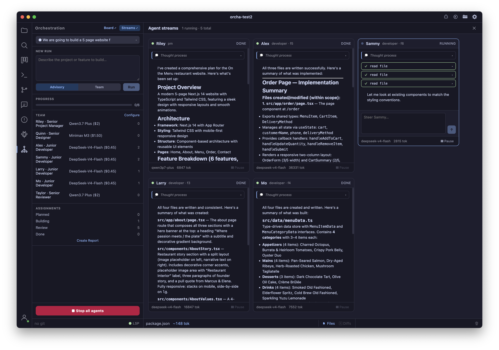
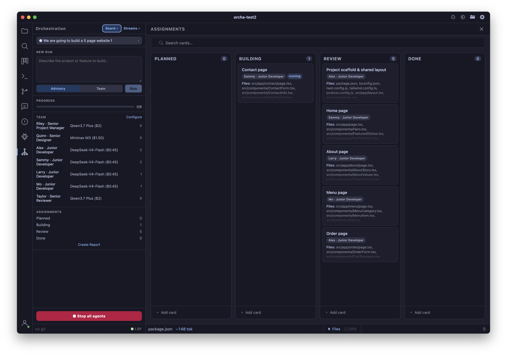

Multi-agent pipeline that decomposes a goal into a plan, builds it with a team of agents (in parallel where safe), and reviews the result — a small AI software team, not a single chat.

- **New Run box** describe a goal, pick Advisory or Team mode, hit Run; the pipeline chains **Plan → Build → Review** automatically in one run
- **Roles & tiers** configurable team in Settings → Orchestrator: a *role* (Project Manager, Designer, Developer, Reviewer, or any custom role you add) has its own system prompt; each role has *agents* (a name + seniority tier + model), so one role can span a Senior on a strong model and Juniors on cheap/fast ones
- **Plan stage** a PM agent decomposes the goal into file-disjoint features (each feature owns a set of files no other feature touches) plus shared naming/structure conventions, written to `plan.json`
- **Build stage, real parallelism** features are grouped into dependency waves; every feature in a wave is file-disjoint by construction, so the whole wave builds **concurrently**, each feature assigned a different agent from its role's roster (round-robin) where more than one is configured, capped by **Max parallel agents** (Settings → Orchestrator)
- **Review stage** a read-only reviewer agent cross-checks the built tree against the plan and writes a verdict (pass / changes-needed) plus a list of issues to `review.json`; Advisory mode always stops here and hands you the report, no send-back loop yet
- **Manual "Run Review"** re-run the review stage on the active run any time (safe mid-run or after a manual code tweak) without starting a whole new run
- **Live monitor** a stream tile per active agent (reasoning, tool calls, streamed text) in a resizable, wrapping grid; pause/resume any agent, or send it a steering message mid-run
- **Assignments board** a Kanban view (Planned → Building → Review → Done) of every feature, reusing the same board component as the project Kanban; open any card to see its assigned agent and status
- **Run report** "Create Report" builds a markdown fan-in report for the active run (plan, build results, review verdict/issues, and real per-agent token costs pulled from the token log) and writes it to that run's own folder, never touches your project files
- **Multiple runs** each run is a self-contained folder (`.coder/orchestration/runs/<runId>/`); a run switcher lets a mono-repo track several runs (e.g. website / api / app) independently
- **Quiet by design** orchestrated agents write files silently (no auto-opened tabs/diffs, no editor streaming) so a multi-agent build never floods your open tabs; the interactive chat agent is unaffected and keeps its normal streaming behavior
- **Toggle** `Cmd+Shift+O` opens and closes the Orchestrator panel

## Shotcut Key Commands

| Shortcut | Action |
|---|---|
| Cmd+Shift+O | Toggle Orchestrator |

