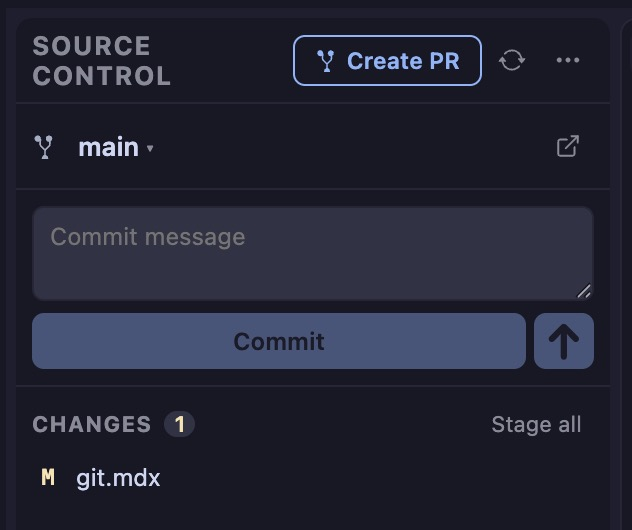
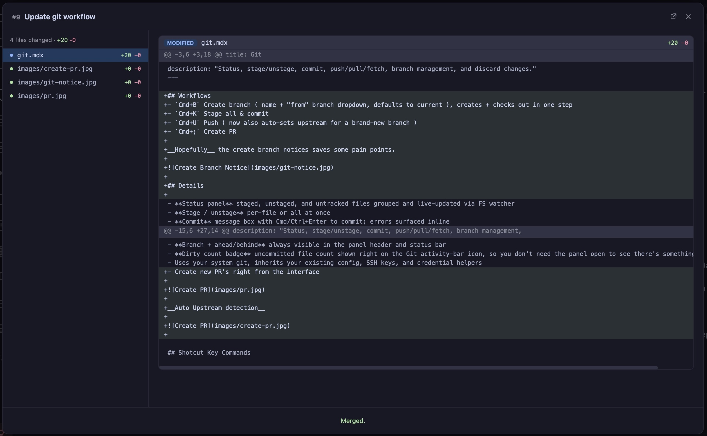

There are two sides to PRs.
- Creating PRs 
- Reviewing PRs 

As we all know managing PRs can be a real pain especially in public projects.

Each of these is also handled in different locations. Creating happens in the [Git panel](/git). Reviewing happens in the [Tickets panel](/tickets).

## Create a PR
In the Git panel click the button, or globally `Cmd+;`

## Review a PR

In the Tickets panel `Shift+Cmd+T` pick a PR ticket and click the title.

