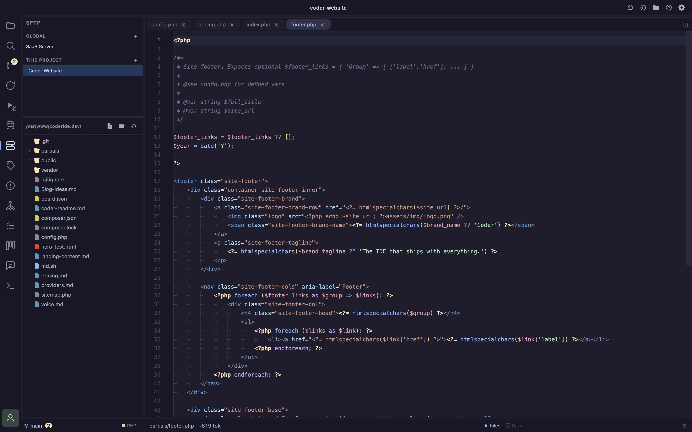

- **Edit remote files like local ones** browse a server's filesystem over SFTP and open any file as a real Monaco tab, same syntax highlighting and editing as a local file; built for the "SSH in, vim a config, SSH out" workflow every VPS deploy eventually needs
- **Global or per-project connections** save a connection to `~/.coder/connections/sftp.json` (available everywhere) or to the open project's `connections/sftp.json` (scoped to that project); the sidebar tree groups both together, same convention as the Databases panel
- **Password or private key auth** either a password or a private-key file (with optional passphrase), picked via a native file browser; secrets never cross into the renderer, only a redacted connection summary does
- **Persistent sessions** a connection stays alive in the background across panel switches and reconnects instantly on reselect, so you don't lose your place browsing a large remote tree; also survives a renderer reload (Cmd+R) without dropping the underlying SSH session, though the browsed folder/expansion state resets then
- **Explicit upload, not silent save** editing a remote file shows a small toolbar above the editor with an **Upload** button and live status (uploading / uploaded / failed with retry); Cmd+S also uploads, but a network write is never assumed to succeed the way a local save is
- **Discard-changes guard** closing a remote tab with unsaved edits asks for confirmation first, since losing an edit to a live server's config is worse than losing a local scratch change
- **Create, rename, delete** New File/New Folder, inline rename, and delete are available from the tree's right-click menu; deleting a non-empty folder (e.g. `vendor/` or `node_modules/`) offers a recursive delete after confirming, since SFTP has no native "rm -rf"
